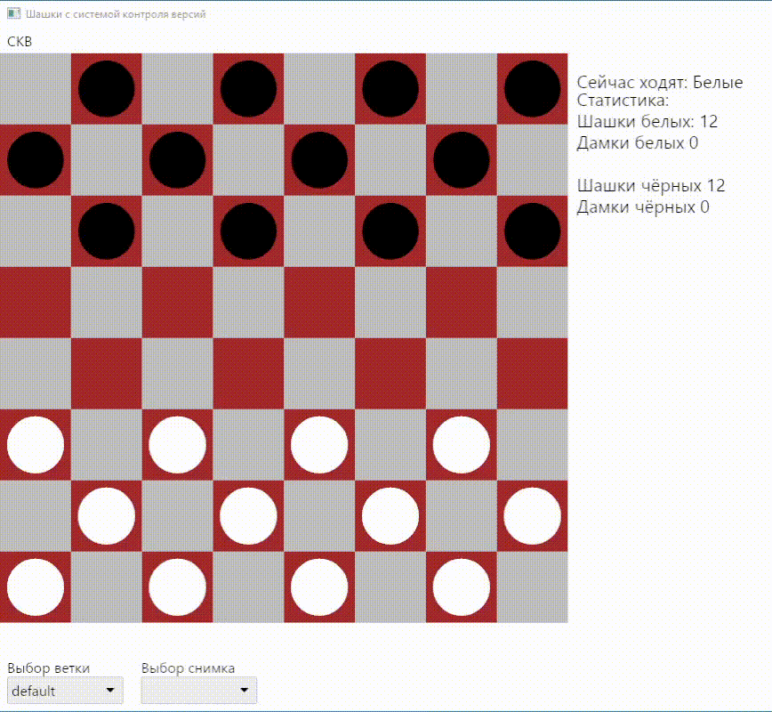

[](https://github.com/iced-rs/iced_aw)
[](https://github.com/iced-rs/iced)
[](https://github.com/iced-rs/iced_aw)
[](https://github.com/serde-rs/serde)

# Шашки с системой контроля версий (СКВ)
## Навигация
- [Используемые технологии](#используемые-технологии)
- [Запуск проекта](#запуск-проекта)
    - [Требования к ресурсам](#требования-к-ресурсам)
- [Примеры работы](#примеры-работы)
    - [Управление](#управление)
        - [Взаимодействие с игровой доской](#взаимодействие-с-игровой-доской)
        - [Взаимодействие с СКВ](#взаимодействие-с-скв)
- [Правила](#правила)
- [Зачем это было создано?](#зачем-это-было-создано)
- [В чем польза ознакомления с проектом](#в-чем-польза-ознакомления-с-проектом)
- [Дальнейшие планы?](#дальнейшие-планы)

---

## Используемые технологии
-  качестве инструмента создания Retained-GUI была выбрана библиотека [iced](https://docs.rs/iced/latest/iced/)
-  для сериализации используется де-факто стандартная библиотека [serde](https://docs.rs/serde/latest/serde/)
-  формат сериализации - бинарный [bincode](https://docs.rs/bincode/latest/bincode/)

## Запуск проекта
Данный проект был протестирован на:
- Windows 10
- Ubuntu 23.04

1. Если у вас не устанвлен Rust toolchain, следуйте [инструкции](https://www.rust-lang.org/learn/get-started)

2. Склонируйте данный проект, перейдите в полученную директорию и запустите проект командой:
```bash
cargo run --release
```
> Первая компиляция может занять продолжительное время

### Требования к ресурсам
Нужно около **~100Мб** ОЗУ для комфортной работы с программой. В частности, на ОС *Ubuntu 23.04* размер потребляемой памяти составляет **~65Мб**, а в ОС *Windows 10* - **~85Мб**

## Примеры работы
<div align="center">
    
</div>

## Управление
### Взаимодействие с игровой доской
Для управления используется мышь. Для выбора фигуры используется **ЛКМ**, для отмены выбора - **ПКМ**. 

При выборе фигуры на доске **зелеными** клеточками подсвечиваются позиции, в которых может быть размещена данная фигура (*передвижение*), а **красными** клеточками - возможные взятия фигур.

### Взаимодействие с СКВ
В любой момент игрового процесса пользователь может создать снимок текущего состояния доски, с помощью меню верхнего уровня (СКВ). С каждым снимков связано некоторое сообщение, описывающее его.

Ветка - обычный указатель на некоторый снимок. Если необходимо сделать развилку в процессе игры, это то, что нужно.

После создания снимка, к нему можно вернуться, выбрав его в списке снимков для выбранной ветки.

> В ближайшее время СКВ может быть устранена из программы

## Правила
### Общие положения
Данная программа не полностью следует всем общепринятым правилам шашек. Так, правило принудительного взятия фигур не реализовано.

- Игроки играют на доске размером 8x8 клеток.
- Изначально у каждого игрока по 12 шашек.
- Игра начинает с  хода белых.
- После хода одной стороны следующих ход передаётся противоположной стороне, за исключением случая, когда на текущем ходу сторона превратила пешку в дамку.
- Пешка ходит вперёд по диагонали, занимая свободную клетку, на расстояние в 1 клетку.
- Пешка бьёт по диагонали в любом направлении. Чтобы взять фигуру противника, нужно, чтобы он находился вплотную к вашей фигуре и чтобы за его фигурой была пустая ячейка.
- Дамка ходит и бьёт по диагонали в любом направлении на любое расстояние, при этом за фигурой противника также должна находиться пустая ячейка, чтобы бьющей было куда встать.
- Если после *взятия* фигуры есть возможность взять еще одну фигуру противника, можно это сделать.
- Как только пешка одной из сторон доходит до противоположного края доски, она превращается в дамку.
- Когда у стороны заканчиваются фигуры, игра заканчивается и перезапускается.

> Если возможно взятие нескольких фигур за один ход, имейте в виду, что нужно сразу перемещать фигуру на желаемую ячейку, так как после вашего хода ход будет передан сопернику.

## Зачем это было создано?
Изначально стояла задача реализовать СКВ для какой-либо игры. Была выбрана относительно примитивная игра - "Шашки". Кроме того, был интерес попробовать использовать для такой цели инструментарий Rust для создания GUI.

Система контроля версий(СКВ) должна была позволять создавать "снимки" состояния доски, различные "ветки" и позволять перемещаться между ними.

Реализованная СКВ большей частью вдохновлена СКВ [Git](https://git-scm.com/book/en/v2), однако имеются и отличия:
- все объекты СКВ в течение работы программы хранятся в оперативной памяти ЭВМ.
- используется один файл для сохранения СКВ между перезапусками. При запуске программы происходит считывание, а перед закрытием - запись.

На данном этапе польза от проекта чисто теоретическая

## В чем польза ознакомления с проектом?
В данном проекте активно используется:
- создание GUI с помощью iced, показан один из возможных подходов к разбиению сообщений (Messages) на подтипы
- graceful shutdown, позволяющий перехватить событие закрытия программы и провести некоторые дополнительные действия перед этим, в данном случае, записать в файл СКВ
- работа с *shared ownership* (Rc<RefCell>), позволяющая изменять один и тот же участок памяти из разных структур
- продвинутые концепции для работы с итераторами([itertools](https://docs.rs/itertools/latest/itertools/)), в частности, для формирования положений фигур и различных проверок по ходу игры

## Дальнейшие планы?
На момент написания этого файла, планируется сделать следующие улучшения:
- Решить судьбу внедрённой СКВ (скорее всего, просто от нее избавиться)
- Покрыть игровую логику автотестами 
- Оптимизировать использование программой оперативной памяти
- Расширить доступный инструментарий программы
- Внедрить возможность добавления переводов текстовых сообщений
- Добавить возможность собственной стилизации элементов интерфейса

- Добавить возможность игры по сети?
